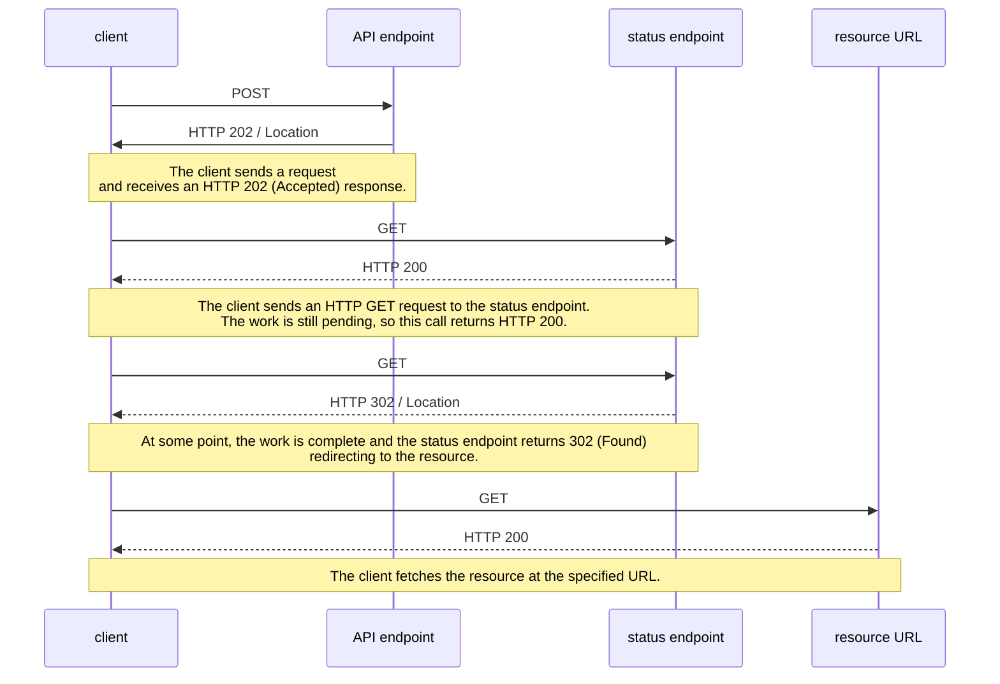

# Long running PHP process testing

Exploring running long processes via a web server. Goal is to implement something like the [Asynchronous Request-Reply pattern](https://learn.microsoft.com/en-us/azure/architecture/patterns/async-request-reply). Initially just exploring how to call an external PHP script from a web page, and getting this work on Heroku. Then will move to API and web clients so we can support long-running jobs in the browser. See also [REST API Design for Long-Running Tasks](https://restfulapi.net/rest-api-design-for-long-running-tasks/).

## Asynchronous Request-Reply pattern

